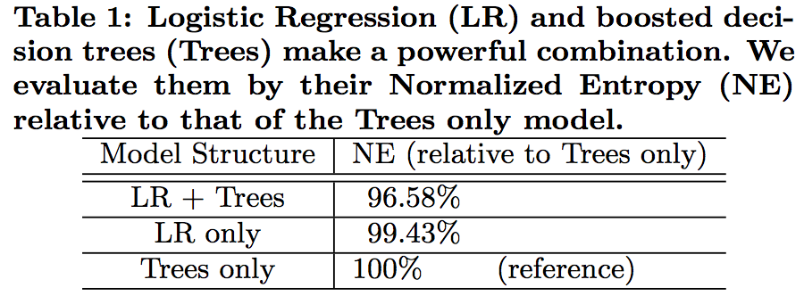
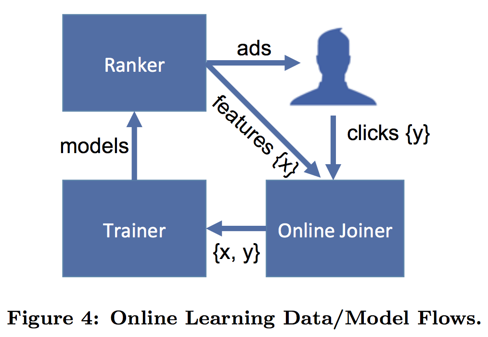

> In this paper we introduce a model which **combines decision trees with logistic regression**, outperforming either of these methods on its own by over **3%**, an improvement with significant impact to the overall system performance.   
We then explore how a number of **fundamental parameters** impact the final prediction performance of our system.

[hypothesis](chrome-extension://bjfhmglciegochdpefhhlphglcehbmek/content/web/viewer.html?file=file%3A%2F%2F%2FUsers%2Fchenxiang%2FPapers%2FCTR%2Fpractical-lessons-from-predicting-clicks-on-ads-at-facebook.pdf)

### 1. 模型结构

  
 
图1 Hybrid model structure

 
在工业界，LR是CTR的常用模型，而模型的瓶颈主要在于特征工程（特征离散化、特征交叉等），因此模型开发人员需要在特征工程上花费大量的时间与精力。为了解决这个问题，该论文提出的一种模型结构：`decision trees + logistic regression`，其中`decision trees`用于feature transformation，而`logistic regression`用于CTR预测。

该论文在数据集上对`decision trees`、`logistic regression`以及`decision trees + logistic regression`这三种模型进行实验，结果如图2所示。

  
 
图2 模型对比结果

 
由图2可知，`decision trees + logistic regression`模型的结果最优，其主要原因可能有以下几点：
- 与人工特征工程相比，利用decision trees进行feature transformation更有效；
- `decision trees + logistic regression`类似于stacking，在不过拟合的情况下，模型stacking的效果会优于单模型；

### 2. online learning

论文中提到，`data freshness`对模型的结果会有影响，如图3所示，delay越小，Normalized Entropy的值越小，即模型预测精度越高。

  
 
图3 Normalized Entropy vs delay

 
因此，为了提升模型的指标，需要提高`data freshness`，即进行`online learning`，其工作流程如图4所示。

  
 
图4 online learning

 
一个`online learning`模块主要涉及到**实时特征提取**和**模型实时训练**这两个部分，其中**实时特征提取**部分对应于该论文中的`online data joiner`，而在`decision trees + logistic regression`模型结构中，**模型实时训练**部分主要针对`logistic regression`的近实时训练（`decision trees`仅用于feature transformation，不需要实时训练）。

### 3. 其他因素

- Number of boosting trees
    
    影响feature transformation后新特征的维度
- Boosting feature importance
    
    用于评估特征的重要性，可用于特征筛选  
- Historical features vs Contextual features
    
    测试结果表明，Historical features（历史操作行为特征）比Contextual features（上下文信息，如用户所使用的终端等）作用更大；而Contextual features可用于处理cold-start问题  
- Sampling
    - Uniform subsampling
    - Negative down sampling

### 4. 总结

模型层面：

- Data freshness matters
- Transforming real-valued input features with boosted decision trees significantly increases the prediction accuracy of probabilistic linear classifiers
- LR with per-coordinate learning rate, which ends up being comparable in performance with BOPR, and performs better than all other LR SGD schemes under study

细节层面：

- The tradeoff between the number of boosted decision trees and accuracy
- Boosted decision trees give a convenient way of doing feature selection by means of feature importance
- For ads and users with history, historical features provide superior predictive performance than context features

总体来说，该论文给出的`decision trees + logistic regression`模型结构不但显著提升了CTR指标，而且在一定程度上减少了特征工程的工作量，该模型的几个优化点如下：

- 在特征维数特别大或数据集特别大的情况下，使用`decision trees`进行feature transformation性价比不高，即训练较耗时且效果不一定很好
- 仍需要对Historical features做一定的特征工程

---

 

# 实现范例
# 来源：http://scikit-learn.org/stable/auto_examples/ensemble/plot_feature_transformation.html
import numpy as np
np.random.seed(10)

import matplotlib.pyplot as plt

from sklearn.datasets import make_classification
from sklearn.linear_model import LogisticRegression
from sklearn.ensemble import GradientBoostingClassifier
from sklearn.preprocessing import OneHotEncoder
from sklearn.model_selection import train_test_split
from sklearn.metrics import roc_curve
from sklearn.pipeline import make_pipeline

n_estimator = 10
X, y = make_classification(n_samples=80000)
# 划分数据集
X_train, X_test, y_train, y_test = train_test_split(X, y, test_size=0.5)
X_train, X_train_lr, y_train, y_train_lr = train_test_split(X_train,
                                                            y_train,
                                                            test_size=0.5)

grd = GradientBoostingClassifier(n_estimators=n_estimator)
grd_enc = OneHotEncoder()
grd_lm = LogisticRegression()

grd.fit(X_train, y_train) # GBDT
grd_enc.fit(grd.apply(X_train)[:, :, 0]) # GBDT feature transform
grd_lm.fit(grd_enc.transform(grd.apply(X_train_lr)[:, :, 0]), y_train_lr) # LR

y_pred_grd_lm = grd_lm.predict_proba(grd_enc.transform(grd.apply(X_test)[:, :, 0]))[:, 1] # GBDT+LR做预测
fpr_grd_lm, tpr_grd_lm, _ = roc_curve(y_test, y_pred_grd_lm)

y_pred_grd = grd.predict_proba(X_test)[:, 1] # 只使用GBDT做预测
fpr_grd, tpr_grd, _ = roc_curve(y_test, y_pred_grd)

plt.figure(1)
plt.plot([0, 1], [0, 1], 'k--')
plt.plot(fpr_grd, tpr_grd, label='GBT')
plt.plot(fpr_grd_lm, tpr_grd_lm, label='GBT + LR')
plt.xlabel('False positive rate')
plt.ylabel('True positive rate')
plt.title('ROC curve')
plt.legend(loc='best')
plt.show()

plt.figure(2)
plt.xlim(0, 0.2)
plt.ylim(0.8, 1)
plt.plot([0, 1], [0, 1], 'k--')
plt.plot(fpr_grd, tpr_grd, label='GBT')
plt.plot(fpr_grd_lm, tpr_grd_lm, label='GBT + LR')
plt.xlabel('False positive rate')
plt.ylabel('True positive rate')
plt.title('ROC curve (zoomed in at top left)')
plt.legend(loc='best')
plt.show()

