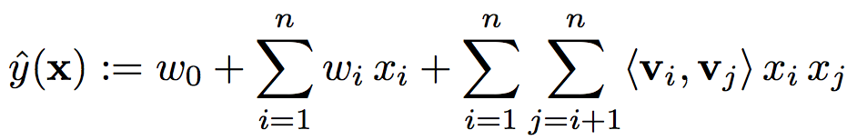
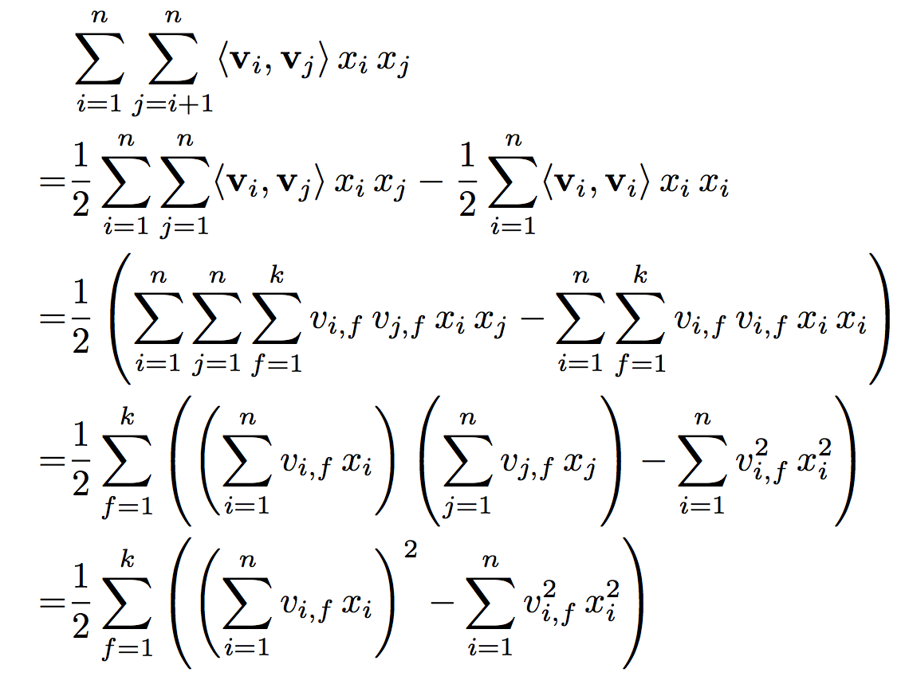
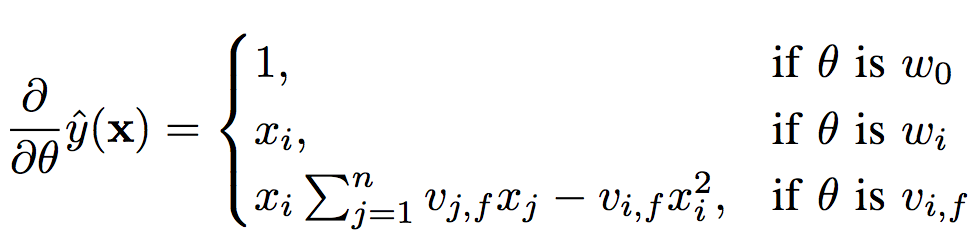

> In this paper, we introduce **Factorization Machines (FM)** which are a new model class that **combines** the advantages of Support Vector Machines (SVM) with factorization models.

[hypothesis](chrome-extension://bjfhmglciegochdpefhhlphglcehbmek/content/web/viewer.html?file=https%3A%2F%2Fwww.csie.ntu.edu.tw%2F~b97053%2Fpaper%2FRendle2010FM.pdf)

### 1. FACTORIZATION MACHINES (FM)

  
 
图1 Factorization Machine Model Equation(d = 2) 

 
由图1可知，FM主要由两个部分构成：**线性部分**和**特征交叉部分**，其中**特征交叉部分**参数的学习是FM的关键。

#### **forward**
在对FM进行forward时，可以发现，特征交叉部分的计算复杂度为O(kn^2)，远高于线性部分。但通过对其进行展开化简后，可将复杂度降低为O(kn)，计算过程如图2所示。

  
 
图2 简化pairwise interactions 

 

#### **backward**
在使用SGD进行参数更新时，需要计算各参数的对应梯度（链式法则求导），其计算过程如图3所示。

  
 
图3 gradient of the FM 

 

通过以上分析，可得出FM的特点如下：

- The interactions between values can be estimated even under **high sparsity**. Especially, it is possible to generalize to unobserved interactions.
- The number of parameters as well as the time for prediction and learning is **linear**.

### 2. FMs VS. SVMs

FMs与SVMs的异同点如下：

- The dense parametrization of SVMs requires direct observations for the interactions which is often not given in sparse settings. Parameters of FMs can be estimated well even under sparsity.
- FMs can be directly learned in the primal. Non-linear SVMs are usually learned in the dual.
- The model equation of FMs is independent of the training data. Prediction with SVMs depends on parts of the training data (the support vectors).

### 3. FMs VS. OTHER FACTORIZATION MODELS

FMs与factorization models的异同点如下：

- Standard factorization models like PARAFAC or MF are not general prediction models like factorization machines. Instead they require that the feature vector is partitioned in m parts and that in each part exactly one element is 1 and the rest 0.
- There are many proposals for specialized factorization models designed for a single task. We have shown that factorization machines can mimic many of the most successful factorization models just by feature extraction which makes FM easily applicable in practice.

### 4. 总结

在FM中能够看到SVM和factorization model的影子，如SVM中的feature interaction，以及factorization model的factorization parametrization，为大规模稀疏特征学习提供了一种思路。
