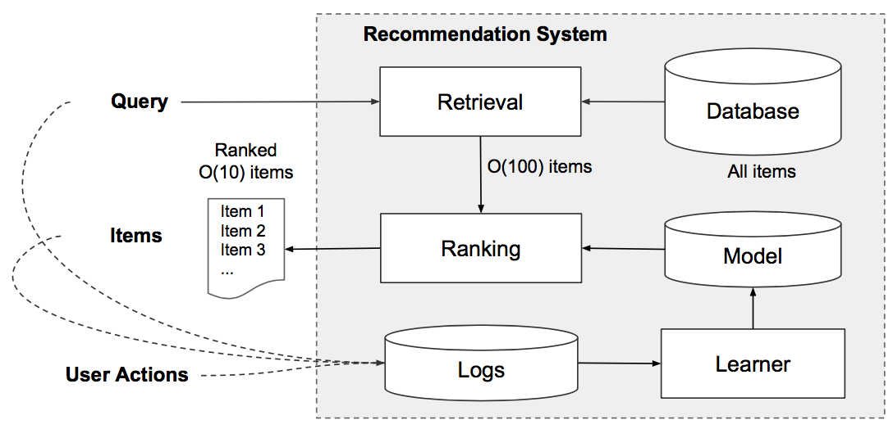
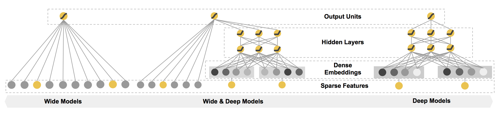
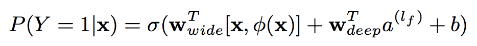
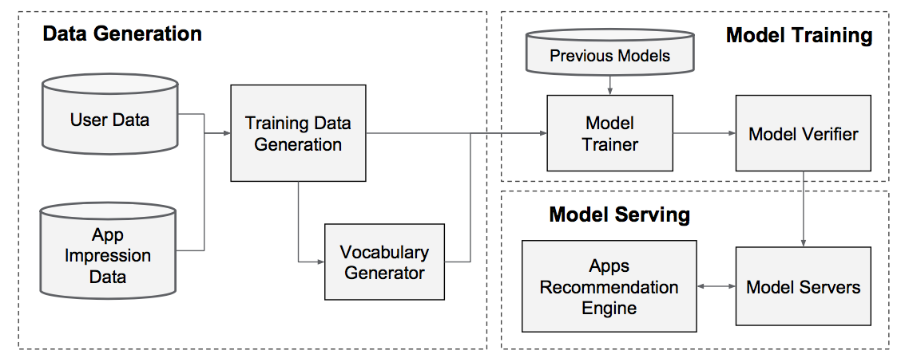
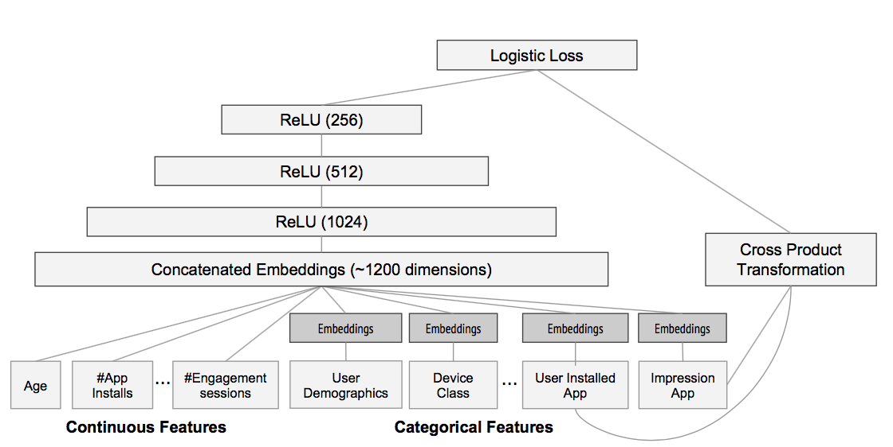
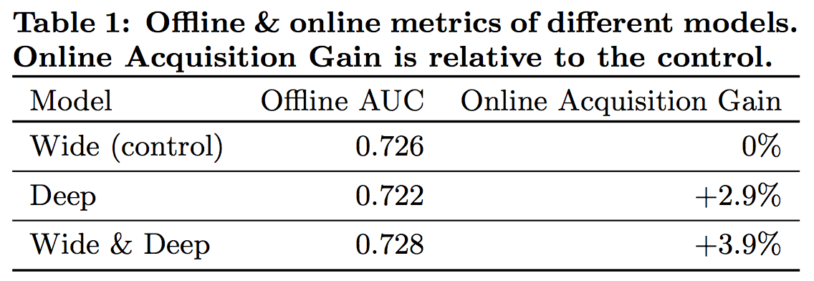
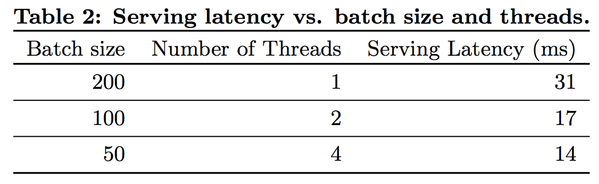

> In this paper, we present Wide & Deep learning — **jointly trained** wide linear models and deep neural networks — to combine the benefits of memorization and generalization for recommender systems.

[hypothesis](chrome-extension://bjfhmglciegochdpefhhlphglcehbmek/content/web/viewer.html?file=https%3A%2F%2Farxiv.org%2Fpdf%2F1606.07792.pdf)

### 1. 推荐系统简介

一个完整的推荐系统主要分为两个部分：**retrieval**和**ranking**，如图1所示（The retrieval system returns a short list of items that best match the query using various signals , usually a combination of machine-learned models and human-defined rules; the ranking system ranks all items by their scores）。

  
 
图1 Overview of the recommender system 

 

### 2. WIDE & DEEP LEARNING

该论文提出了一种用于**ranking**模块的`Wide & Deep learning framework`，如图2所示。

  
 
图2 The spectrum of Wide & Deep models

 

该框架包括两个部分：`Wide Component`和`Deep Component`。那么，为什么需要这两个部分呢？论文中给出了解释：

- Memorization of feature interactions through a ***wide*** set of cross-product feature transformations are effective and interpretable, while generalization requires more feature engineering effort
- With less feature engineering, ***deep*** neural networks can generalize better to unseen feature combinations through low-dimensional dense embeddings learned for the sparse features

另外，在整个框架中，`Wide Component`和`Deep Component`进行**joint training**，即两者的结果输入到一个logistic loss function中，如图3所示，因此在训练过程中同时更新各自的参数。

  
 
图3 Wide & Deep model

 

该论文以Apps推荐为例，给出了Wide & Deep model的落地方案。图4为该Apps推荐系统的pipeline，主要包括`Data Generation`、`Model Training`以及`Model Serving`这三个部分：

- `Data Generation`：用于生成训练数据
- `Model Training`：模型训练，模型的具体结构如图5所示
- `Model Serving`：模型部署（响应时间为10 ms左右）

  
 
图4 Apps recommendation pipeline overview

 

  
 
图5 Wide & Deep model structure for apps recommendation

 

图6展示了`Offline AUC/Online Acquisition Gain`的实验结果。

  
 
图6 Offline & online metrics of different models

 

有意思的是`Deep`的`Offline AUC`比`Wide`要低，但是其`Online Acquisition Gain`比`Wide`要高2.9%。对于这一现象可能有几种解释：
- 相比`Deep`，`Wide`更易在Offline的数据集上过度学习，即`overfit`
- Offline metrics与Online metrics不线性相关

总之，如何设计Offline metrics或者offline测试也是一个重要的研究课题。

图7展示了`Serving Latency`的实验结果，显然，`Serving Latency`主要依赖于Batch size和Number of Threads。

  
 
图7 Serving latency

 

### 3. 总结

- `Wide & Deep model structure`：在`Wide`的基础上，引入`Deep`模块用于特征提取（Wide linear models can effectively **memorize sparse feature interactions** using cross-product feature transformations; deep neural networks can **generalize to previously unseen feature interactions** through low-dimensional embeddings）
- `joint training`：与ensemble和stacking等模型训练方式相比，`joint training`是一种新颖的模型训练方式
