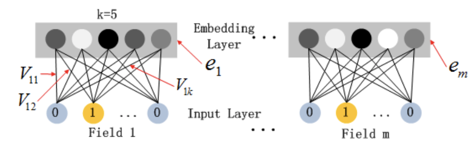
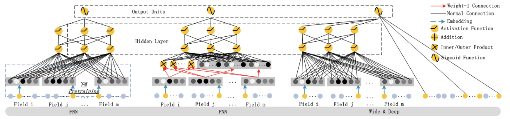
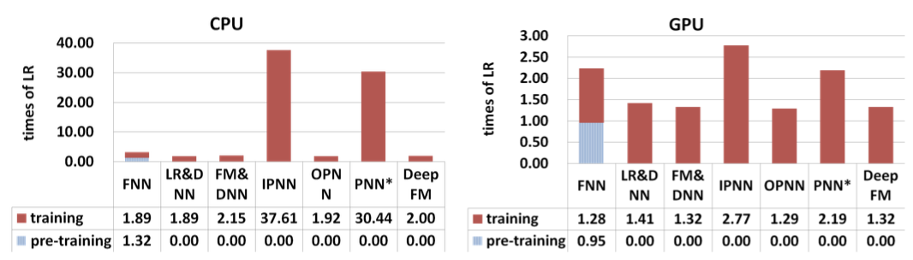

> In this paper, we show that it is possible to derive an **end-to-end** learning model that emphasizes both **low-** and **high-** order feature interactions. The proposed model, **DeepFM**, combines the power of factorization machines for recommendation and deep learning for feature learning in a new neural network architecture.

[hypothesis](chrome-extension://bjfhmglciegochdpefhhlphglcehbmek/content/web/viewer.html?file=https%3A%2F%2Farxiv.org%2Fpdf%2F1703.04247.pdf)

### 1. DeepFM

  
 
图1 Wide & deep architecture of DeepFM

 

为了学习`low-order`和`high-order`的feature interactions，该论文提出了一种Factorization-Machine based neural network (**DeepFM**)，其包括两个模块：`FM component`和`deep component`，如图1所示。其中`FM component`用于学习low-order feature interactions，而`deep component`用于学习high-order feature interactions，与`Wide & Deep`模型类似，这两个模块也是`joint training`：

  
 
图2 DeepFM joint training

 

#### FM Component

  
 
图3 The architecture of FM

 
`FM component`就是一个factorization machine，如图3所示，其包括两个计算单元：**Addition unit**和**Inner Product units**：

- Addition units：作用于Sparse Feature上
- Inner Product units：作用于Dense Embeddings上

#### Deep Component

  
 
图4 The architecture of DNN

 
`deep component`是一个feed-forward neural network，如图4所示，其用于学习high-order feature interactions。在该DNN结构中，为了处理具有超高维、稀疏、categorical-continuous-mixed等特点的raw feature，需要添加一层embedding layer，将raw feature转变为一个low-dimensional、dense real-value vector。

需要注意的是，与tensorflow的embedding实现不同（`tf.feature_column.embedding_column(col)`），该模型使用FM的latent feature vectors作为参数计算最终的结果，如图5所示：

  
 
图5 The structure of the embedding layer

 

另外，由图3和图4可知，`FM component`与`deep component`共享embedding layer，这么做的好处是：

- it learns both low- and high-order feature interactions from raw feature
- there is no need for ex- pertise feature engineering of the input, as required in Wide & Deep

### 2. 其他相关Neural Networks

在DeepFM之前，也有一些deep models用于CTR预测的报道，如图6所示：

  
 
图6 The architectures of existing deep models for CTR prediction: FNN, PNN, Wide & Deep Model

 

- `FNN`：一个FM-initialized feed-forward neural network，图6(左)所示
- `PNN`：与FNN类似，只不过在embedding layer与the first hidden layer中间添加了一层product layer，图6(中)所示
- `Wide & Deep`：能够同时对low- and high-order feature interactions进行学习的feed-forward neural network，图6(右)所示

由图6可知，各模型的重点都是研究如何处理大规模稀疏特征，即模型输入，而模型的结构都较为简单。

### 3. 实验
该论文从计算复杂度和效果两个角度对各模型进行评测：

- Efficiency Comparison

  
 
图7 Time comparison

 

- Effectiveness Comparison

  
 
图8 Performance on CTR prediction

 

结果显示，无论在计算复杂度以及模型效果上，DeepFM均占优。

另外，论文还对模型的Hyper-Parameters进行了实验，如Activation Function、Number of Neurons per Layer、Number of Hidden Layers和Network Shape等。

### 4. 总结

该论文给出了DeepFM在计算复杂度以及模型效果上获得提升的原因：

- it does not need any pre-training
- it learns both high- and low-order feature interactions
- it introduces a sharing strategy of feature embedding to avoid feature engineering
