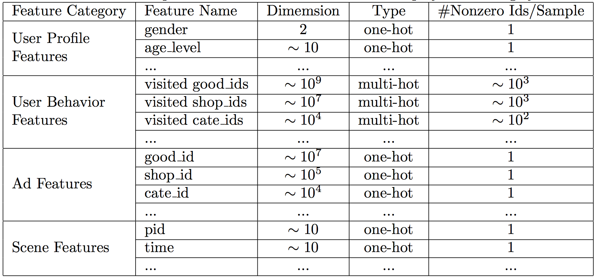
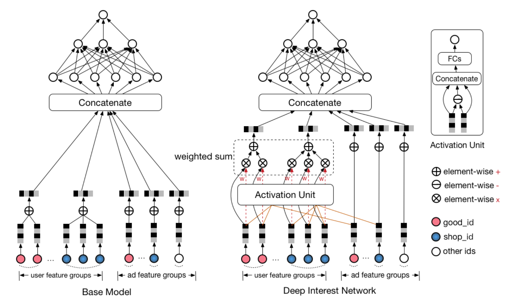
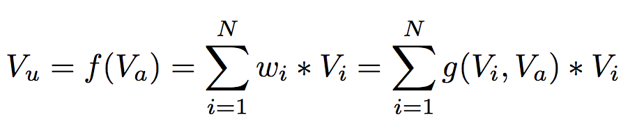
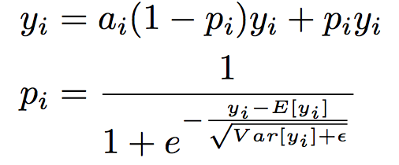
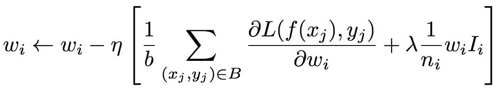
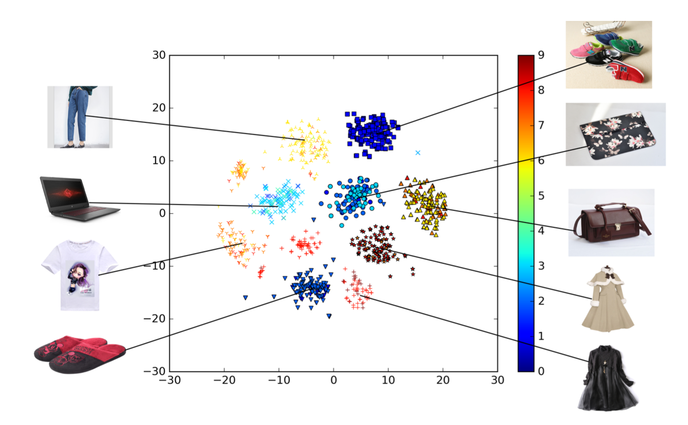
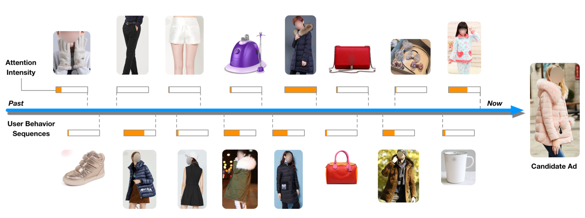
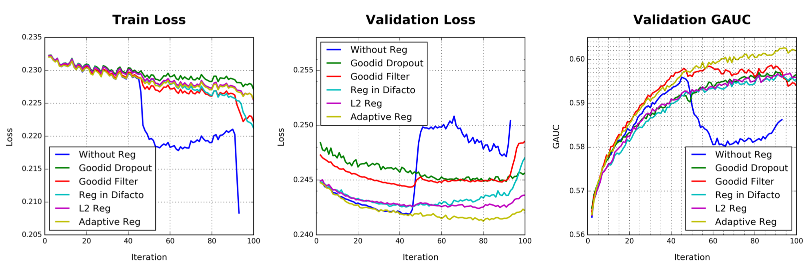
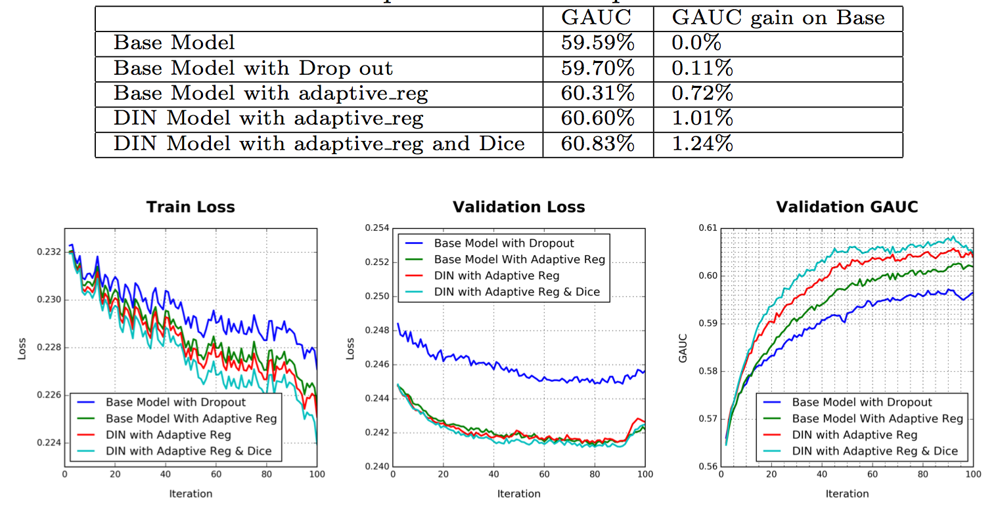

> In this paper, we introduce a new proposed model, **Deep Interest Network (DIN)**, which represents users’ diverse interests with an interest distribution and designs an attention-like network structure to locally activate the related interests according to the candidate ad, which is proven to be effective and significantly outperforms traditional model.

[hypothesis](chrome-extension://bjfhmglciegochdpefhhlphglcehbmek/content/web/viewer.html?file=https%3A%2F%2Farxiv.org%2Fpdf%2F1706.06978.pdf)

### 1. 系统简介

用户登录一个e-commerce网站后，系统会进行如下响应：
1. checks his historical behavior data
2. generates candidate ads by <b>matching module</b>
3. predicts the click probability of each ad and selects appropriate ads which can attract attention (click) by <b>ranking module</b>
4. logs the user reactions given the displayed ads

用户与ad的交互行为具有两个特点：
- **Diversity**

    Users are interested in different kind of goods
- **Local activation**

    Only a part of users’ historical behaviors are relevant to the candidate ad

该论文将用户的行为group到4个分组下，如图1所所示：

  
 
图1 Feature Representations and Statistics in our display advertising system

 

> Note that in our setting there are no combination features. We capture the interaction of features with deep network.

在CTR预测中，feature interactions是影响模型性能的关键因素，需要大量的先验知识，而该论文利用deep network完成这部分工作。

另外，该论文使用**GAUC**作为CTR预测的评测指标，其具体含义请参考论文，此处不做分析。

### 2. 模型结构

模型的出发点：our system need an effective approach to extract users’ interests from the rich <b>historical behavior</b> while building the click-through rate (CTR) prediction model。

  
 
图2 Model Architecture

 

#### Base Model

`Base Model`是一种常见的deep network模型，如图2（左）所示，其主要包括两步：1）transfer each sparse id feature into a embedded vector space；2）apply MLPs to fit the output。该模型的一个问题在于，为了处理用户不定长的历史行为，需要对embedding后的向量进行pooling，该操作会损失很多有效信息。

#### Deep Interest Network

用户行为的`diversity`和`local activation`特性，与NMT的任务很类似，在decode时句子中不同的单词其重要性不同。为了解决这个问题，NMT引入`attention mechanism`（Attention network (can be viewed as a special designed pooling layer) learns to assign attention scores to each word in the sentence, which in other words follows the diversity structure of data）。

在CTR场景下，表征用户兴趣的embedding vector应该随candidate ads的不同而变化（embedding vector of user interest should vary according to different candidate ads, that is, it should follow the local activation structure）。为此，设计了一种新的网络结构，**Deep Interest Network（DIN）**，如图2（右）所示，其主要特点是计算用户behavior ids的embedding vector时考虑了ad embedding vector的影响，计算过程如图3所示，该计算单元又称为`activation unit`，其输入是embedding of behavior id和distributed representation of ads，输出是attention score。

  
 
图3 user behavior ids embedding

 

总之，`Deep Interest Network`是在`Base Model`的基础上，引入了activation unit，以对user behavior data进行更有效的distributed representation learning。

除了模型结构外，为了避免过拟合（很容易在large scale parameters和sparse inputs的情况下出现），该论文在Activation Function以及Regularization上也进行了改进：

- Data Dependent Activation Function `Dice`

  
 

 
- Adaptive Regularization

  
 

 

另外，论文提到了模型的实现环境：X-Deep Learning (XDL)，一个multi-GPU distributed training platform，支持model-parallelism 和 data-parallelism。

### 3. 实验

#### Visualization

图4为商品embedding后的分布情况，其中形状代表商品类别，颜色代表CTR预测结果（以一个年轻妈妈用户为例）。

  
 
图4 Visualization of embeddings of goods in DIN model

 

图5展示了用户历史行为的attention score与candidate ad的关系，可知，与candidate ad越相似的行为得分越高。

  
 
图5 Illustration of locally activation property in DIN model

 

#### Regularization

  
 
图6 Performance of reduction of overfitting with different regularizations

 

#### 模型比较

  
 
图7 Performance of DIN and Base Model

 

### 4. 总结

- 提供了一种对具有diversity和local activation特点的用户历史数据进行特征提取的解决方案
- end-to-end learning，无需做大量的特征工程
- 提出一种adaptive regularization技术，用于解决在训练industrial deep networks过程中出现的overfitting问题
